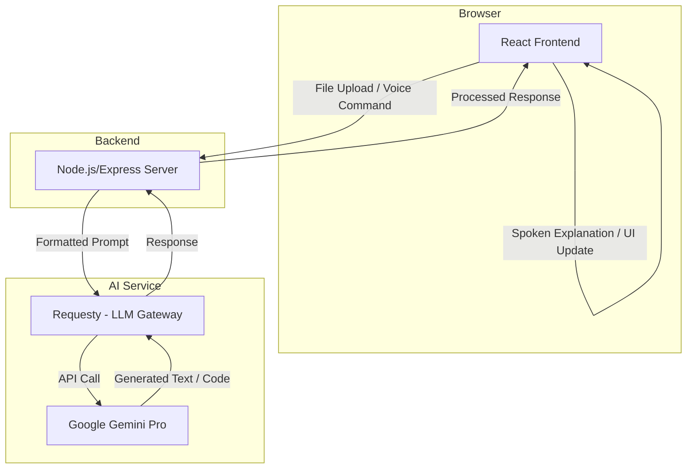

# System Architecture

This document provides a high-level overview of the system architecture for the "Code Accessibility AI" application, with a focus on the central role of the Google Gemini Pro LLM.

## Architecture Diagram

## Components

### 1. Client (React)

*   **Description:** The frontend of the application, built with React.
*   **Responsibilities:**
    *   Provides a user interface for file uploads and voice commands.
    *   Records and transmits user voice input.
    *   Renders code and AI-generated suggestions.
    *   Uses the Web Speech API (or a similar library) for text-to-speech playback of Gemini's explanations.

### 2. Server (Node.js/Express)

*   **Description:** The backend of the application, built with Node.js and Express.
*   **Responsibilities:**
    *   Provides a RESTful API for the client.
    *   Constructs detailed prompts for Gemini based on user input.
    *   Communicates with the Requesty LLM Gateway to get responses from Gemini.
    *   Processes Gemini's responses before sending them to the client.

### 3. AI Service (Requesty + Gemini)

*   **Description:** The core AI engine of the application.
*   **Responsibilities:**
    *   **Code Explanation:** Analyzes and summarizes code into natural language for visually impaired developers.
    *   **Voice Command Interpretation:** Interprets natural language voice commands to refactor or generate code.
    *   **Color-Blind Friendly Suggestions:** Analyzes frontend code to identify and suggest accessible color palettes and UI improvements.
