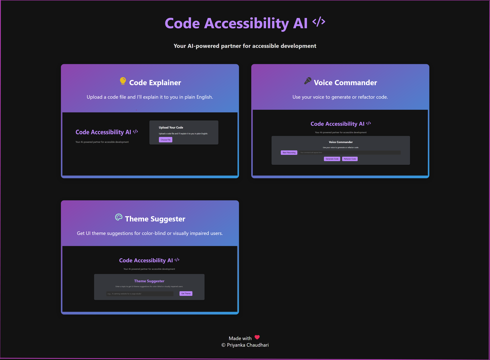

<div align="center">
   <h1>💻 Code Accessibility AI 💻</h1>
   <br/>
   &nbsp;
   &nbsp;
   &nbsp;
   &nbsp;
   &nbsp;
   
   <br/>
   <h3>Dev Tools for All</h3>
</div>

<h4 align="center">A web-based suite of tools designed to make software development more accessible to everyone, especially people with visual impairments, powered by LLM.</h4>
<p align="center">
        
</p>


## 🚀 Features

*   **🗣️Spoken Code Explanations:** Converts code into spoken explanations for visually impaired developers, using LLM to summarize and simplify complex code.
*   **🎤 Voice Commands:** Allows for voice-driven code refactoring and generation, with LLM interpreting natural language commands.
*   **🎨 Color-Blind Friendly UI Suggestions:** Provides recommendations for creating more accessible user interfaces, with LLM analyzing code and suggesting accessible color palettes.

## 🛠️ Tech Stack

<table>
   <tr>
      <td><b>Frontend:<b></td>
      <td></td>
   </tr>
      <tr>
          <td><b>Backend: <b></td>  
         <td>  &nbsp; </td>
       </tr>
      <tr>
         <td><b>AI Tools:</b></td>
         <td> &nbsp;  </td>
      </tr>
</table>


## 📁 Project Structure

*   `client`: Contains the React frontend application.
*   `server`: Contains the Node.js backend application.

## ⚡ Setup Instructions
### Frontend

```bash
cd client
npm install
npm start
```
### Backend

```bash
cd server
npm install
# Create your .env file locally
npm start
```
Note: Make sure you have configured an API key for OpenRouter. 
OpenRouter URL and Model I have used:
```bash
OPENROUTER_URL=https://openrouter.ai/api/v1/chat/completions
OPENROUTER_MODEL=deepseek/deepseek-chat-v3.1:free
```
Make sure to set up OPENROUTER_URL, OPENROUTER_MODEL and OPENROUTER_API_KEY in `.env`

## ✨ Contribution Guidelines
Even though this is a hackathon project, contributions and feedback are welcome:
1. Fork this repository.
2. Clone your fork locally.

```bash
git clone <your-fork-url>
```

3. Create a new branch and implement changes.
```bash
   git checkout -b <branch-name>
```
4. Add, commit, and push changes.
   
```bash
git add .
git commit -m "Your message"
git push origin <branch-name>
```

## 📌 Notes
- Ensure `node_modules` and `.env` are handled locally; they are excluded from Git.
- Submodules are used for the backend:
```bash
git submodule update --init --recursive
```

